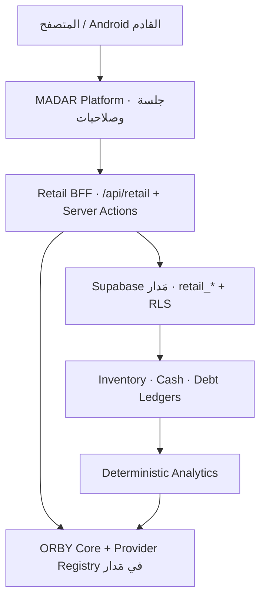

# MADAR Retail Integration Architecture

## الحدود الحالية

MADAR Retail مساحة مستقلة وظيفيًا داخل `madar-platform`، وليست تطبيق Auth أو قاعدة ثانية. المنصة الرئيسية هي مصدر الهوية والصلاحيات والمزودات وORBY، وجداول Retail المعزولة بأسماء `retail_*` موجودة داخل Supabase الرئيسي.

## مسارات المنتج

| السطح | المسار |
|---|---|
| Landing عامة | `/retail` |
| إعداد المنظمة | `/retail/onboarding` |
| مساحة التشغيل | `/retail/workspace/*` |
| إدارة Retail | `/admin/retail` |
| ORBY Retail | `/api/retail/orby` |
| Sync v1 | `/api/retail/v1/sync/*` |

## الثقة والبيانات

- Cookies `madar-access-token` و`madar-refresh-token` تخص Supabase الرئيسي فقط.
- العضوية في `organization_members` هي مصدر صلاحية Retail؛ OWNER/ADMIN/MEMBER تتحول إلى OWNER/MANAGER/STAFF.
- `platform_organization_id` يربط منظمة مَدار بمساحة Retail واحدة داخل القاعدة نفسها.
- لا توجد مفاتيح Retail إضافية. عميل الخادم يستخدم إعداد Supabase الرئيسي، ويتحقق أولًا من جلسة مَدار والمنظمة ثم يقيّد كل قراءة بـworkspace المرتبط.
- جداول الخدمة تحمل بادئة `retail_` لمنع اصطدامها بجداول مَدار، وتفعل RLS عبر `retail_workspace_members`.
- الكتابات لا تنفذ CRUD ماليًا. `retail_platform_execute` جسر service-only بقائمة عمليات ثابتة، يعيد actor UUID داخل معاملة PostgreSQL ثم يستدعي RPCs الأصلية؛ لذلك تبقى الذرية، idempotency، العضوية، الاشتراك والledgers فعالة.
- لا تمنح طبقة Retail الدور `authenticated` تنفيذ SECURITY DEFINER RPCs المالية مباشرة.

## الطبقات

| الطبقة | المسار |
|---|---|
| UI | `app/retail`, `components/retail-v0` |
| BFF/Auth federation | `src/lib/retail/server/auth`, `src/lib/retail/supabase` |
| Domain | `src/lib/retail/domain`, `src/lib/retail/types.ts` |
| Financial mutations | `src/lib/retail/server/retail/actions.ts` + PostgreSQL RPCs |
| Analytics | `src/lib/retail/server/analytics` + `retail_analytics_snapshot` |
| ORBY | `app/api/retail/orby`, ORBY Core الرئيسي، grounding الحتمي |
| Sync | `app/api/retail/v1/sync`, `src/lib/retail/sync` |
| Database | `supabase/migrations/2026081218*_retail_*.sql` |

Dashboard يجمع الأرقام في SQL، ولا ينقل آلاف الصفوف للمتصفح. الأموال `numeric` والحركات المالية تنجح كاملة أو تتراجع كاملة.
